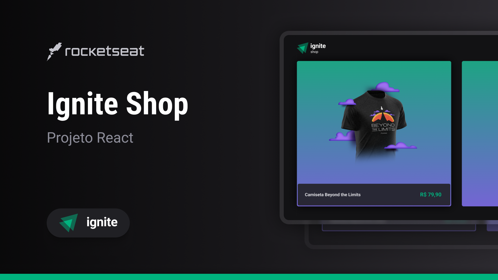

  

<h1 align="center">Application developed during the classes to learn about NextJS</h1>

---

## 🎥 Preview or access the site [here](https://ignite-shop-project.vercel.app/)

### Listing all the products 👕

 

### Adding and removing from the shopping cart 🛒

 

### Purchasing products 💸

 

---

## 🚀 I went beyond the challenge

I did more than was requested to me

- ✔️ I did a `shopping cart` to buy more than one product
- ✔️ I create a `quantity counter` to each product

 

---

## 📚 Learning

All the things that I learned and practiced with this project

- I learn `NextJS` to create SSG and SSR applications
- I learn how to use `getServerSideProps` to run code in the server side
- I learn how to use `getStaticProps` to run code only when build the application
- I learn the benefits of using `Link` component from NextJS
- I learn the benefits of using `Image` component from NextJS
- I learn how to use the `Stripe` API

 

---

## 🧪 Technologies

This project was developed using de following technologies:

- [React](https://react.dev/)
- [Typescript](https://www.typescriptlang.org/)
- [Stripe API](https://stripe.com/docs/api?lang=node)
- [NextJS](https://nextjs.org/)
- [Stitches](https://stitches.dev/)
- [Phosphor Icons](https://phosphoricons.com/)
- [Radix](https://www.radix-ui.com/)
- [Axios](https://axios-http.com/ptbr/docs/intro)
- [Keen slider](https://keen-slider.io/)

 

---

## 🔖 Layout

You can view the project layout through the links below:

- [Layout](https://www.figma.com/file/FxlDRKOmznBbTH8DsTgnZU/Ignite-Shop-2.0/duplicate)

Remembering that you need to have a [Figma](http://figma.com/) account to access it.

 

---

Developed by [ricardorhv](https://github.com/ricardorhv) 👋
